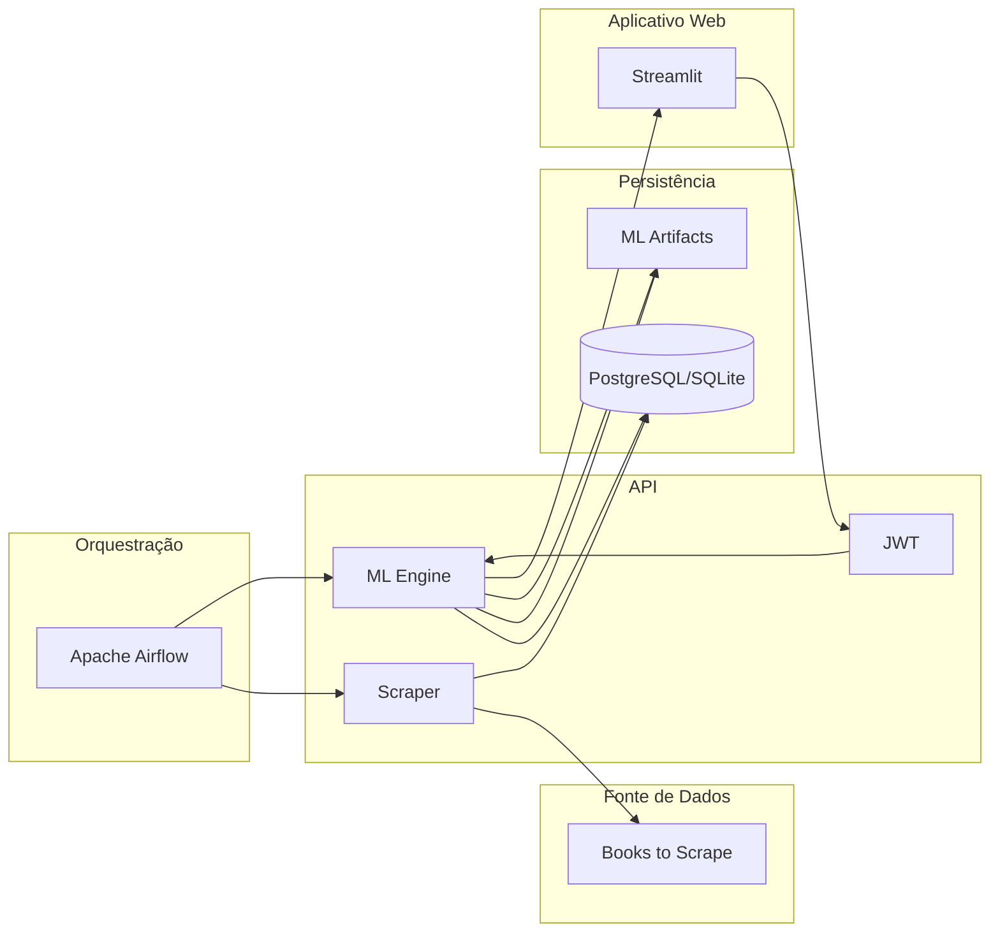

# Repositório da API para o Tech Challenge da Fase 1 da Pós-Graduação em Machine Learning Engineering da FIAP

Esta é uma API RESTful construída com Flask cujo objetivo consistiu no desenvolvimento de uma infraestrutura robusta para a extração, transformação e disponibilização de dados por meio de uma API pública, visando facilitar o consumo dessas informações por cientistas de dados e serviços de recomendação. Para atender aos requisitos, o desenvolvimento pautou-se na implementação de um pipeline ETL automatizado via web scraping, na construção de uma interface escalável e padronizada, na estruturação de uma arquitetura ML-ready para suporte ao ciclo de vida de modelos e na aplicação de protocolos de governança, segurança e rastreabilidade.

Como resultado, a solução consolidou a integração de rotinas de web scraping para aquisição de dados e um motor de recomendação fundamentado em processamento de linguagem natural. No que tange à infraestrutura de serviços, a API passou a dispor de segurança via JSON Web Tokens (JWT) com ciclos de renovação, otimização de performance por meio de camadas de cache e uma robusta camada de observabilidade, que persiste logs de auditoria de todas as transações no banco de dados.

### Arquitetura

O diagrama abaixo descreve a arquitetura do projeto na sua integridade e com sua principais funcionalidades:



### Pré-requisitos

Certifique-se de ter o Python 3.11 e o Poetry instalados em seu sistema.

Para instalar o Poetry, use o método oficial:

```bash
curl -sSL https://install.python-poetry.org | python3 -
```


### Instalação

Clone o repositório e instale as dependências listadas no pyproject.toml:

```bash
git clone https://github.com/jorgeplatero/postech-ml-techchallenge-fase-1.git
cd postech-ml-techchallenge-fase-1
poetry install
```

O Poetry criará um ambiente virtual isolado e instalará todas as bibliotecas de processamento de dados e IA necessárias.

### Como Rodar a Aplicação

**Via Docker (Recomendado):**

Execute o comando abaixo para subir o ambiente completo (API + Dependências):
```bash
docker-compose up --build
```

**Local:**

1. Execute as migrações do banco de dados:

```bash
poetry run alembic upgrade head
```
2. Inicie a aplicação:

```bash
poetry run python app.py
```

A API estará rodando em http://127.0.0.1:5000/ e a documentação interativa Swagger em `/apidocs`.

## Funcionalidades

### 1. Autenticação e Usuários (`/api/v1/auth`)

Use estes endpoints para gerenciar o acesso à API.

- **Register (/register)**: Cria um novo usuário e retorna os tokens iniciais (Access e Refresh).
- **Login (/login)**: Autentica o usuário e gera o par de tokens JWT.
- **Refresh (/refresh)**: Gera um novo token de acesso utilizando um Refresh Token válido.

### 2. Catálogo de Livros (`/api/v1/books`)

Endpoints para consulta e filtragem do acervo.

- **Titles (/titles)**: Lista todos os títulos de livros cadastrados (Protegido/Cache).
- **Details (/<id>)**: Retorna os detalhes técnicos completos de um livro por ID (Protegido/Cache).
- **Search (/search)**: Busca livros por título e/ou gênero via parâmetros de query (Protegido/Cache).
- **Price Range (/price-range)**: Filtra livros por faixa de preço mínima e máxima (Protegido/Cache).
- **Top Rated (/top-rated)**: Retorna os livros com melhores avaliações (Protegido/Cache).

### 3. Machine Learning e Recomendação (`/api/v1/ml`)

Motor de inteligência artificial para sugestão de conteúdo.

- **Features (/features)**: Lista os dados processados e tokenizados usados no modelo (Protegido).
- **Training (/training-data)**: Executa o pipeline de treinamento (TF-IDF) e salva os artefatos `.pkl` (Protegido).
- **Predictions (/predictions)**: Recebe um título e retorna os 10 livros mais similares (Protegido/Cache).
- **User History (/user-preferences/<user_id>)**: Lista o histórico de recomendações salvas para o usuário (Protegido/Cache).

### 4. Estatísticas e Gestão (`/api/v1/stats`, `/api/v1/genres`, `/api/v1/scrape`)

- **Stats Overview (/stats/overview)**: Estatísticas gerais como preço médio e total de livros (Protegido/Cache).
- **Stats Genres (/stats/genres)**: Análise detalhada de preços e volumes por gênero (Protegido/Cache).
- **Genres (/genres)**: Lista todas as categorias disponíveis no sistema (Protegido/Cache).
- **Scrape (/scrape)**: Aciona o robô de Web Scraping para atualizar a base de dados (Protegido).
- **Health (/health)**: Verifica o status da API e a conectividade com o Banco de Dados.

### Tecnologias

A aplicação atua como a camada de serviço (API) que interage com o cliente, o motor de ML e o banco de dados.

| Componente | Tecnologia | Versão (Especificada) | Descrição |
| :--- | :--- | :--- | :--- |
| **Backend/API** | **Flask** | `>=3.1.2, <4.0.0` | Framework Python para o desenvolvimento da API RESTful. |
| **Machine Learning** | **Scikit-learn** | `>=1.7.2, <2.0.0` | Utilizada para vetorização TF-IDF e cálculo de similaridade de cosseno. |
| **NLP** | **NLTK** | `>=3.9.2, <4.0.0` | Processamento de linguagem natural para descrições de livros. |
| **Data Analysis** | **Pandas** | `>=2.3.3, <3.0.0` | Manipulação e estruturação de dados para treinamento e estatísticas. |
| **Autenticação** | **Flask-JWT-Extended** | `>=4.7.1, <5.0.0` | Segurança via JWT e gestão de ciclo de vida de tokens (Refresh). |
| **Persistência/ORM** | **Flask-SQLAlchemy** | `>=3.1.1, <4.0.0` | Camada ORM para interação com o banco de dados. |
| **Migrações DB** | **Alembic** | `>=1.17.2, <2.0.0` | Controle de versão e migrações do esquema de banco de dados. |
| **Performance** | **Flask-Caching** | `>=2.3.1, <3.0.0` | Sistema de cache para otimização de endpoints de consulta. |
| **Infraestrutura** | **Docker** | `3.8 (Compose)` | Containerização para garantir paridade de ambiente e deploy. |
| **Gerenciamento** | **Poetry** | `2.2.1` | Gerenciador de dependências e ambientes virtuais. |

### Integrações

A API em produção recebe requisições de aplicativo web desenlvolvido com Streamlit, cujo link e repositório pode ser acessado em:

Aplicativo: https://

Repositório GitHub: https://github.com/postech-mlengineering/postech-ml-techchallenge-fase-1-streamlit

### Deploy

Esta API possui arquivo de configuração para deploy via **Docker** e suporte a variáveis de ambiente. Para produção:

1. Altere a `JWT_SECRET_KEY` para uma chave forte e armazene-a como variável de ambiente.

2. Configure a `DATABASE_URL` para apontar para um banco persistente.